# [SECRETS](https://secrets-276f7be740ae.herokuapp.com)

[](https://github.com/EfthymiaKakoulidou/secrets/commits/main)
[](https://github.com/EfthymiaKakoulidou/secrets/commits/main)
[](https://github.com/EfthymiaKakoulidou/secrets)


Sometimes it is easier to tell your secrets to the world than to people you know. Sometimes you feel the need to just get stuff out of your chest. Sometimes you need to know that you are not alone and that there are other people with similar secrets going through the the same stuff. Sometimes it helps to just write stuff down. 
The 'Secrets' app is a place where people can share their secrets and get support from other users in the form of comments or private messages. The users can read other peoples' secrets and the comments they got so that they can relate to them and feel less alone. The Diary is a place where the user can write his/hers thoughts and secrets and nobody else has access to it.


source: [amiresponsive](https://ui.dev/amiresponsive?url=https://secrets-276f7be740ae.herokuapp.com)

## UX

  - The choice of the UX design derives from the charected of the site. Secrets are something that is hidden in the first place and that is why only authenticated users can view the content of the site. 
  - Easy navigation was also goal and thats why the navbar items are descriptive to what they include. The "Share a secret" item is a separate link making even more easy to upload your secrets. The deault picture that is used when the user does not upload his/her owns pictures makes it also very clear that now the secret is revealed. 
  - The diary section is the only one that uses a different font. This font is like handwritting making it more personal and inticating that this part of the site is only accessible to the specific user. Diary has no CRUD functionality in the same way that you wouldn't go back and change or delete your actual diary. Entries belong to history.
  - The messages section is structured like the ones we all been used to. The ordering of the messages and the fact that there is no CRUD functionality here either is intentinal to make it more like the social apps we are used to.

### Colour Scheme

I chose to use black and antiquewhite as my basic colours being inspired by the image of an old notebook or diary that is used to store our secrets. 


### Typography

I chose a very clear font for almost all text in the site except when the user is writing to his/hers diary. There I chose a font that looks more like it is handwritten.

- [Oxygen](https://fonts.google.com/specimen/Oxygen) was used for the primary headers and titles.

- [Indie Flower](https://fonts.google.com/specimen/Indie+Flower?classification=Handwriting) was used for all other secondary text.

- [Font Awesome](https://fontawesome.com) icons were used throughout the site, such as the social media icons in the footer, the navbar, the edit and delete buttons of a secret and the icons underneath the secrets where the user can show support by hugging, comment a secret and reach_out to someone.

## User Stories


### New Site Users

- As a new site user, I would like signin or signup, so that I can have access to the site.
- As a new site user, I would like to be informed about what this site is all about, so that I can decide if it is for me.
- As a new site user, I would like to check my profile, edit or delete it, so that I can control the information I am giving out.
- As a new site user, I would like to check other peoples' profiles, so that I can choose people to interact with.
- As a new site user, I would like to share a secret with users of the site, so that I can unburden myself and feel relief.
- As a new site user, I would like to edit and delete my secrets, so that I update information or in case I changed my mind.
- As a new site user, I would like to check other peoples' secrets, so that I can see if I can find something I can relate to.
- As a new site user, I would like to comment on other peoples posts, so that I can express my opinion.
- As a new site user, I would like to edit or delete my comments in case I change my mind.
- As a new site user, I would like to keep a diary, so that I can document my thoughts and be helped by the process of writing.
- As a new site user, I would like to message people privately and show support, so that I can connect with others and give and get help.
- As a new site user, I would like to read the blog, so that I can get information about topics around keeping secrets and psychology of it.
- As a new site user, I would like to signout, so that I can feel safe that my information is protected.

### Returning Site Users

- As a returning site user, I would like to do all of the above for the same reasons.
- As a returning site user, I would like to check my messages and see if I have new, so that I can keep in touch with people.
- As a returning site user, I would like to check the feed, so that I can be updated with new information.

### Site Admin

- As a site administrator, I should be able to add, edit and delete a blogpost, so that I can keep the users informed about this topic.
- As a site administrator, I should be able to handle all the information that is included in the site, so that I can check the content.


## Wireframes


To follow best practice, wireframes were developed.
These wireframes were made at the arly stages of the projects so there are some changes made along the way.
They provide the layoutstructure that was used for the site.
I've used [Balsamiq](https://balsamiq.com/wireframes) to design my site wireframes.

### Wireframes

<details>
<summary> Click here to see the Wireframes </summary>

Home
  - 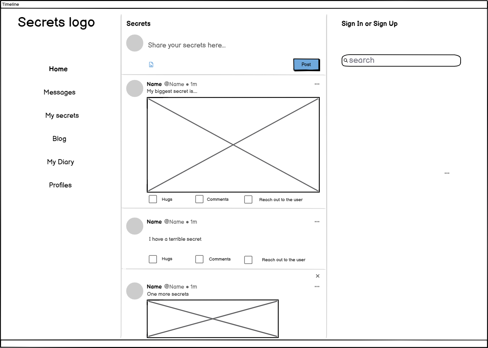

Home when logged in
  - 

My Secrets
  - 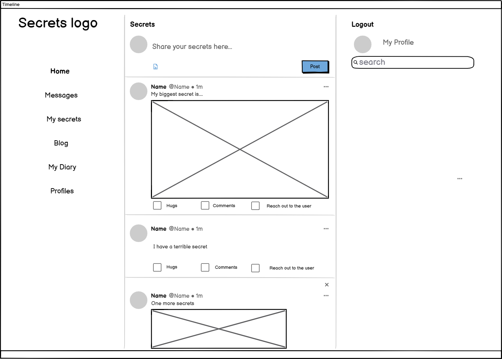

Messages
  - 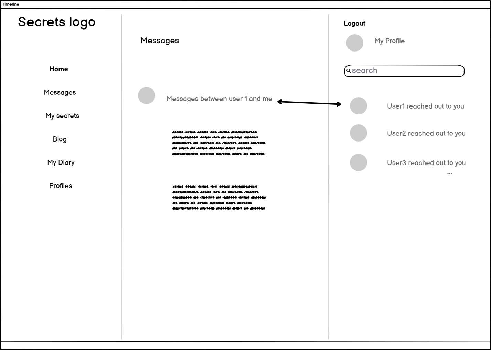

My Diary
  - 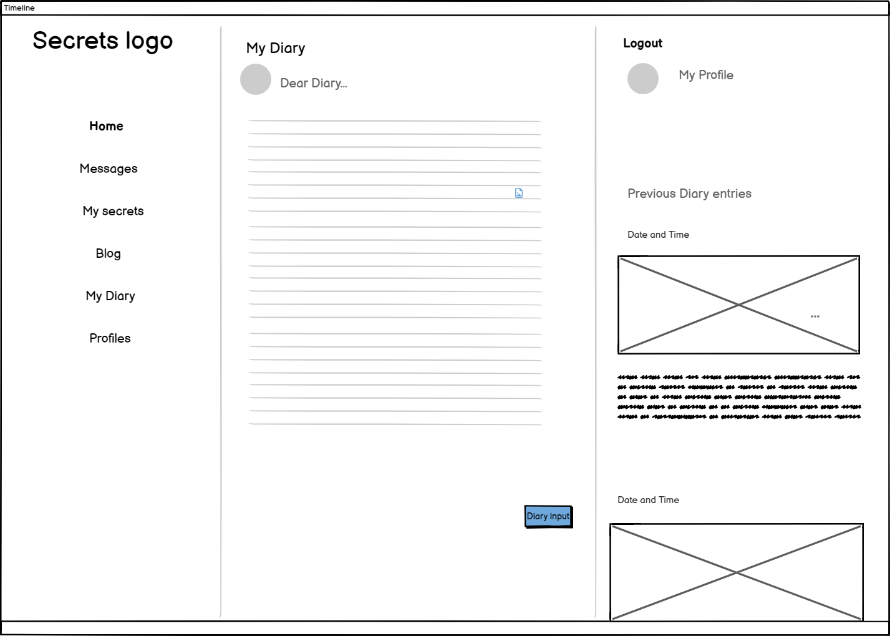

Admins blog
  - 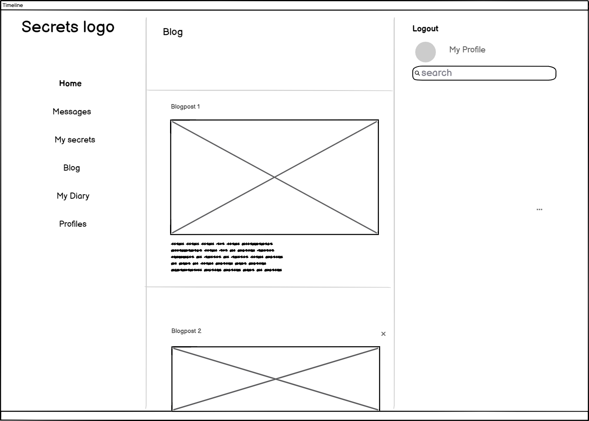

Profiles
  - 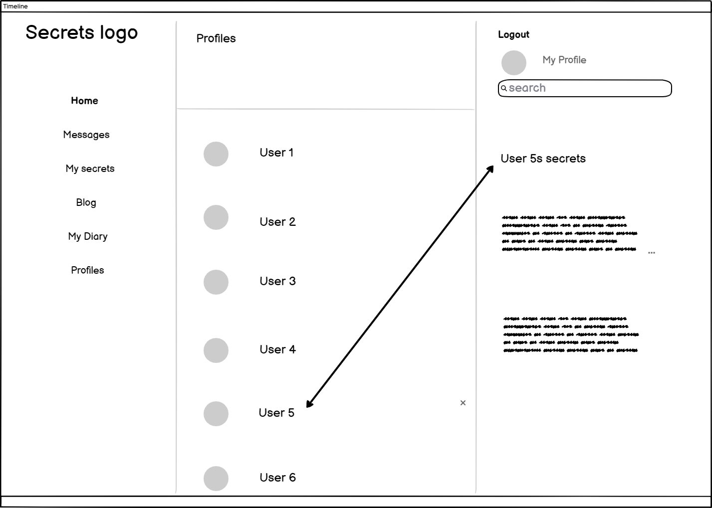

</details>

## Features


### Existing Features

- **Logo**

    - At the top left of the page there is the logo of the site and its name 'Secrets' which the user can click and be redirected to the home page.


- **Sign in/Sign Up**

    - At the top left of the page the user can be informed if he/she is logged in or not. In the case the user does not have an account he/she can sign up.


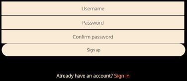

- **Side Navbar**

    - The side Navbar is the navigation tool of the user. There the user can find all the content of the page.

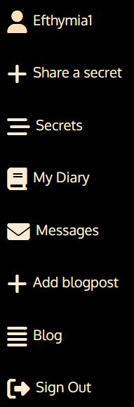

- **Profile**

    - The username appears next. It is an andication that the user is logged in and a link to profile page.

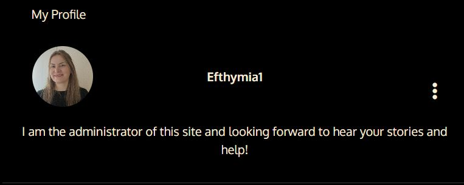

- **Profile Page**

    - On this page, appart from the profile's details the user can see a list of all the profiles. Each of the users' avatars links to their profile.


- **Share a secret**

    - On this page the user can fill the form to add a secret.

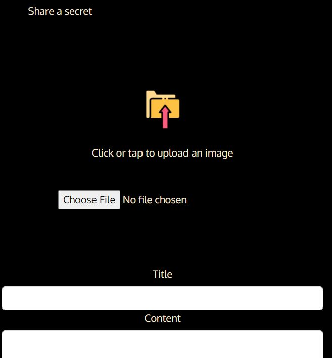

- **Secrets**

    - Here is the feed with all the posted secrets. When a user clicks on a secret they are redirected to the secret's details and is able to see all the comments that people have left on this secrets. The user can also leave his/hers comments and edit or delete them if they have written them. If the user has posted this secret he/she can edit or delete them.

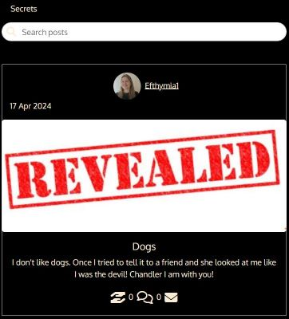
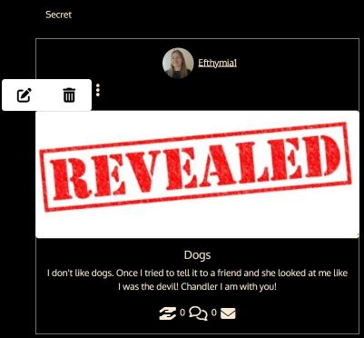
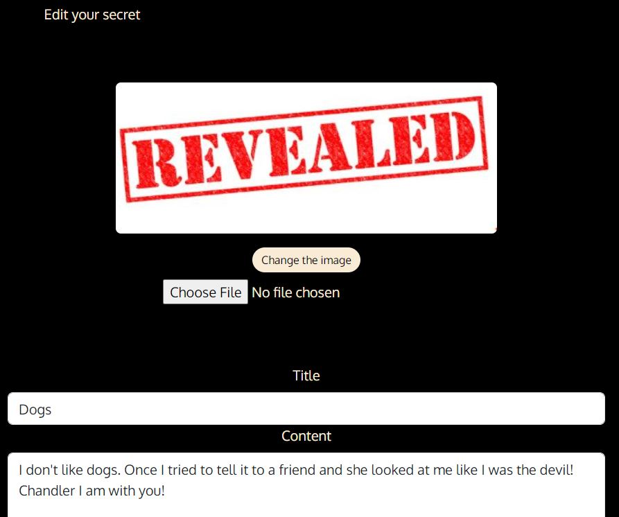
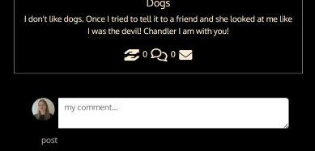

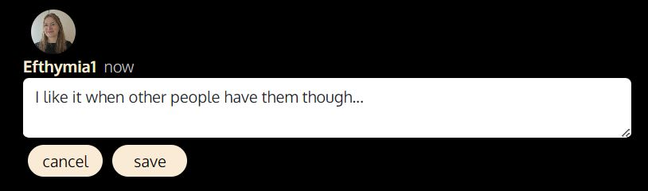

- **My Messages**

    - If the user has reached out to somebody or somebody has reached out to the user then their messages will appear on this page. When the user clicks on an item of the list of the messages then he/she is redirected to the thread he/she has with the user that reached out to him/her or the person he/she has reached out to. There he/she can add a message to that thread.

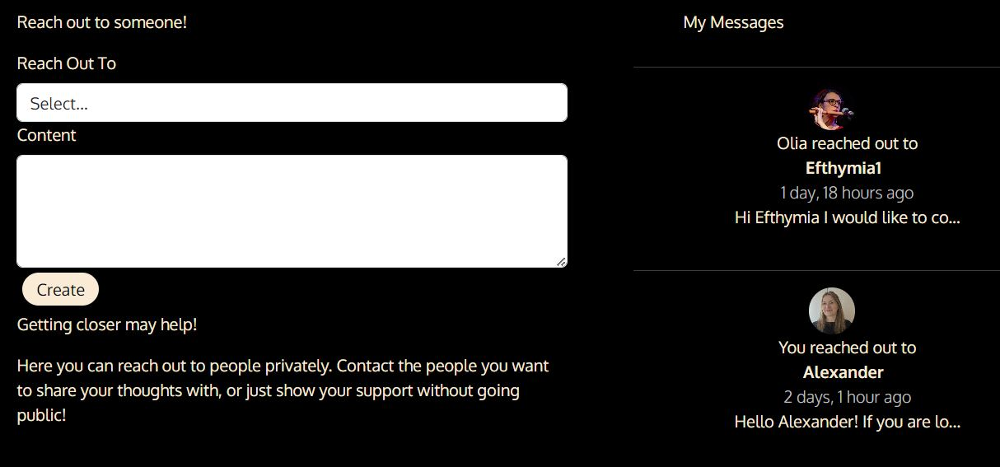
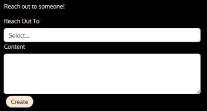
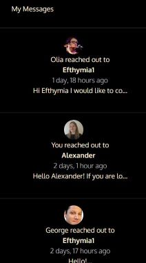
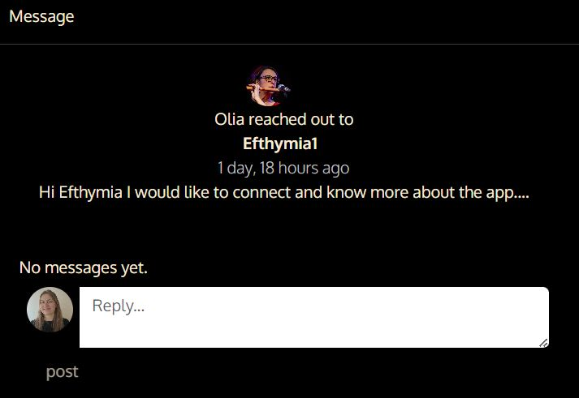
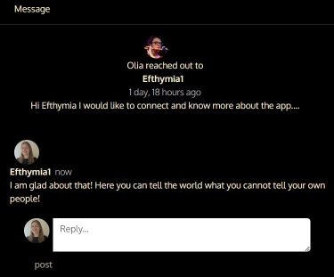

- **My Diary**

    - Here the user can write anything that just he/she will have access to. Previous entries to the diary will also appear on this page. When the user clicks on a diary entry then he/she is redirected to the page that shows the whole content of the entry.

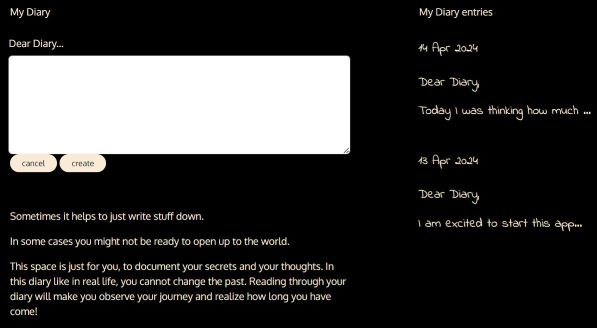
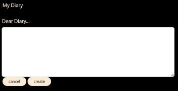


- **Add blogpost if the user is an administrator and Admins Blog**

    - If the user is an administrator then he gets an extra choice on the navbar to add a blogpost. He/she can add a blogpost and edit or delete it.


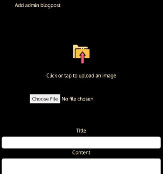

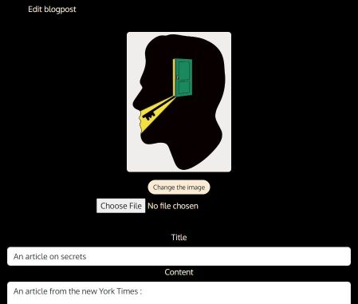

- **Sign Out**

    - The user can sign out.

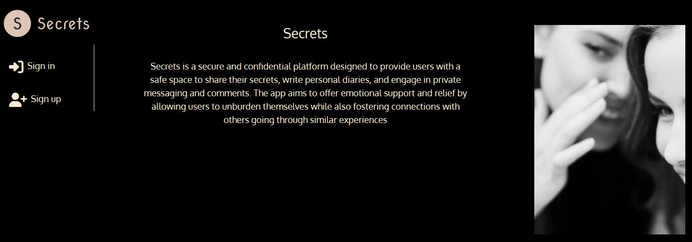


- **Not found**

    - If the page the user tries to access then he/she will be informed about it.


- **Error page**

    - If the user tries to access a page that he/she is not authorized to access then they will be informed about it.

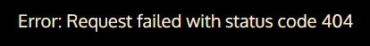

### Future Features

- Professional help
    - I think that it would be helpful if the users get professional help through the site. In the future an authentication of documents can be added so that professionals can submit their degrees be authenticated and then provide their help to the users.
- Confirm you are over 18
    - I imagine that the content of this site is going to include entries for adults so some kind of protection for the kids would be useful.
- User connections
    - 'Secrets' goal is not popularity so the follow function is not relevant here. The users are connected to each other through comments, hugs and 'reach out' which works like private messages. Maybe in the future some feature could be added to connect profiles between them so that a community can be created.
- Categories
    - It would also be very helpful to categorize the secrets so that the users can choose which parts of the contents they are interested in.


## Tools & Technologies Used


- [](https://tim.2bn.dev/markdown-builder) used to generate README and TESTING templates.
- [](https://git-scm.com) used for version control. (`git add`, `git commit`, `git push`)
- [](https://github.com) used for secure online code storage.

- [](https://gitpod.io) used as a cloud-based IDE for development.

- [](https://en.wikipedia.org/wiki/HTML) used for the main site content.
- [](https://en.wikipedia.org/wiki/CSS) used for the main site design and layout.
- [](https://www.javascript.com) used for user interaction on the site.
- [](https://www.python.org) used as the back-end programming language.
- [](https://pages.github.com) used for hosting the deployed front-end site.
- [](https://www.heroku.com) used for hosting the deployed back-end site.
- [](https://getbootstrap.com) used as the front-end CSS framework for modern responsiveness and pre-built components.
- [](https://www.djangoproject.com) used as the Python framework for the site.
- [](https://www.postgresql.org) used as the relational database management.
- [](https://dbs.ci-dbs.net) used as the Postgres database from Code Institute.
- [](https://www.elephantsql.com) used as the Postgres database.
- [](https://cloudinary.com) used for online static file storage.
- [](https://whitenoise.readthedocs.io) used for serving static files with Heroku.
- [](https://balsamiq.com/wireframes) used for creating wireframes.
- [](https://fontawesome.com) used for the icons.
- [](https://chat.openai.com) used to help debug, troubleshoot, and explain things.

## Database Design

For all information related to the backend please reffer to the pp5api here : https://github.com/EfthymiaKakoulidou/pp5api

## Agile Development Process

### GitHub Projects

[GitHub Projects](https://github.com/EfthymiaKakoulidou/secrets/projects) served as an Agile tool for this project.
It isn't a specialized tool, but with the right tags and project creation/issue assignments, it can be made to work.

Through it, user stories, issues, and milestone tasks were planned, then tracked on a weekly basis using the basic Kanban board.

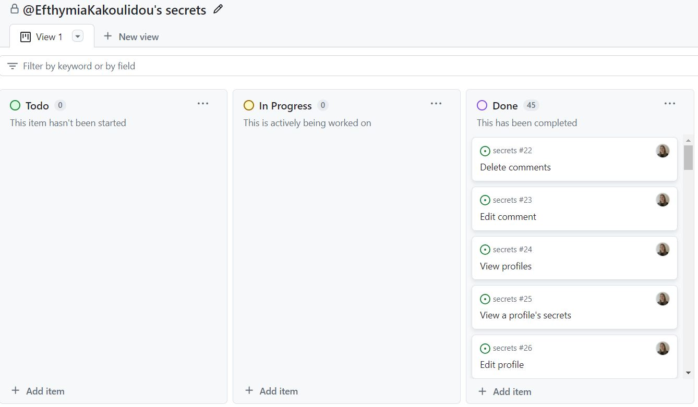

### GitHub Issues

[GitHub Issues](https://github.com/EfthymiaKakoulidou/secrets/issues) served as an another Agile tool.

It also helped with milestone iterations on a weekly basis.

- [Open Issues](https://github.com/EfthymiaKakoulidou/secrets/issues) [](https://github.com/EfthymiaKakoulidou/secrets/issues)

    

- [Closed Issues](https://github.com/EfthymiaKakoulidou/secrets/issues?q=is%3Aissue+is%3Aclosed) [](https://github.com/EfthymiaKakoulidou/secrets/issues?q=is%3Aissue+is%3Aclosed)

    

### MoSCoW Prioritization

I've decomposed my Epics into stories prior to prioritizing and implementing them.
Using this approach, I was able to apply the MoSCow prioritization and labels to my user stories within the Issues tab.

- **Must Have**: guaranteed to be delivered (*max 60% of stories*)
- **Should Have**: adds significant value, but not vital (*the rest ~20% of stories*)
- **Could Have**: has small impact if left out (*20% of stories*)
- **Won't Have**: not a priority for this iteration


## Testing

> [!NOTE]  
> For all testing, please refer to the [TESTING.md](TESTING.md) file.

## Deployment


The live deployed application can be found deployed on [Heroku](https://secrets-276f7be740ae.herokuapp.com).

### PostgreSQL Database

This project uses a [Code Institute PostgreSQL Database](https://dbs.ci-dbs.net).

To obtain my own Postgres Database from Code Institute, I followed these steps:

- Signed-in to the CI LMS using my email address.
- An email was sent to me with my new Postgres Database.

> [!CAUTION]  
> - PostgreSQL databases by Code Institute are only available to CI Students.
> - You must acquire your own PostgreSQL database through some other method
> if you plan to clone/fork this repository.
> - Code Institute students are allowed a maximum of 8 databases.
> - Databases are subject to deletion after 18 months.


### Heroku Deployment

This project uses [Heroku](https://www.heroku.com), a platform as a service (PaaS) that enables developers to build, run, and operate applications entirely in the cloud.

Deployment steps are as follows, after account setup:

- Select **New** in the top-right corner of your Heroku Dashboard, and select **Create new app** from the dropdown menu.
- Your app name must be unique, and then choose a region closest to you (EU or USA), and finally, select **Create App**.
- From the new app **Settings**, click **Reveal Config Vars**, and set your environment variables.

> [!IMPORTANT]  
> This is a sample only; you would replace the values with your own if cloning/forking my repository.

| Key | Value |
| --- | --- |
| `DATABASE_URL` | user's own value |
| `DISABLE_COLLECTSTATIC` | 1 (*this is temporary, and can be removed for the final deployment*) |
| `SECRET_KEY` | user's own value |


Heroku needs three additional files in order to deploy properly.

- requirements.txt
- Procfile
- runtime.txt

You can install this project's **requirements** (where applicable) using:

- `pip3 install -r requirements.txt`

If you have your own packages that have been installed, then the requirements file needs updated using:

- `pip3 freeze --local > requirements.txt`

The **Procfile** can be created with the following command:

- `echo web: gunicorn app_name.wsgi > Procfile`
- *replace **app_name** with the name of your primary Django app name; the folder where settings.py is located*

The **runtime.txt** file needs to know which Python version you're using:
1. type: `python3 --version` in the terminal.
2. in the **runtime.txt** file, add your Python version:
	- `python-3.9.18`

For Heroku deployment, follow these steps to connect your own GitHub repository to the newly created app:

Either:

- Select **Automatic Deployment** from the Heroku app.

Or:

- In the Terminal/CLI, connect to Heroku using this command: `heroku login -i`
- Set the remote for Heroku: `heroku git:remote -a app_name` (replace *app_name* with your app name)
- After performing the standard Git `add`, `commit`, and `push` to GitHub, you can now type:
	- `git push heroku main`

The project should now be connected and deployed to Heroku!

### Local Deployment

This project can be cloned or forked in order to make a local copy on your own system.

For either method, you will need to install any applicable packages found within the *requirements.txt* file.

- `pip3 install -r requirements.txt`.

You will need to create a new file called `env.py` at the root-level,
and include the same environment variables listed above from the Heroku deployment steps.

> [!IMPORTANT]  
> This is a sample only; you would replace the values with your own if cloning/forking my repository.

Sample `env.py` file:

```python
import os

os.environ.setdefault("DATABASE_URL", "user's own value")

os.environ.setdefault("SECRET_KEY", "user's own value")


# local environment only (do not include these in production/deployment!)
os.environ.setdefault("DEBUG", "True")
```

Once the project is cloned or forked, in order to run it locally, you'll need to follow these steps:

- Start the React app: `npm start`
- Stop the app once it's loaded: `CTRL+C` or `⌘+C` (Mac)
- Everything should be ready now, so run the Django app again: `python3 manage.py runserver`


#### Cloning

You can clone the repository by following these steps:

1. Go to the [GitHub repository](https://github.com/EfthymiaKakoulidou/secrets) 
2. Locate the Code button above the list of files and click it 
3. Select if you prefer to clone using HTTPS, SSH, or GitHub CLI and click the copy button to copy the URL to your clipboard
4. Open Git Bash or Terminal
5. Change the current working directory to the one where you want the cloned directory
6. In your IDE Terminal, type the following command to clone my repository:
	- `git clone https://github.com/EfthymiaKakoulidou/secrets.git`
7. Press Enter to create your local clone.

Alternatively, if using Gitpod, you can click below to create your own workspace using this repository.

[](https://gitpod.io/#https://github.com/EfthymiaKakoulidou/secrets)

Please note that in order to directly open the project in Gitpod, you need to have the browser extension installed.
A tutorial on how to do that can be found [here](https://www.gitpod.io/docs/configure/user-settings/browser-extension).

#### Forking

By forking the GitHub Repository, we make a copy of the original repository on our GitHub account to view and/or make changes without affecting the original owner's repository.
You can fork this repository by using the following steps:

1. Log in to GitHub and locate the [GitHub Repository](https://github.com/EfthymiaKakoulidou/secrets)
2. At the top of the Repository (not top of page) just above the "Settings" Button on the menu, locate the "Fork" Button.
3. Once clicked, you should now have a copy of the original repository in your own GitHub account!

### Local VS Deployment

There are no differences between the local and the deployed verison of the site.

## Credits

I used the walkthrough "Moments" from the Code Institute's LMS to help me structure my project.

### Content

🛑🛑🛑🛑🛑🛑🛑🛑🛑🛑-START OF NOTES (to be deleted)

Use this space to provide attribution links to any borrowed code snippets, elements, or resources.
A few examples have been provided below to give you some ideas.

Ideally, you should provide an actual link to every resource used, not just a generic link to the main site!

⚠️⚠️ EXAMPLE LINKS - REPLACE WITH YOUR OWN ⚠️⚠️

🛑🛑🛑🛑🛑🛑🛑🛑🛑🛑-END OF NOTES (to be deleted)

| Source | Location | Notes |
| --- | --- | --- |
| [Markdown Builder](https://tim.2bn.dev/markdown-builder) | README and TESTING | tool to help generate the Markdown files |
| [Chris Beams](https://chris.beams.io/posts/git-commit) | version control | "How to Write a Git Commit Message" |
| [W3Schools](https://www.w3schools.com/howto/howto_js_topnav_responsive.asp) | entire site | responsive HTML/CSS/JS navbar |
| [W3Schools](https://www.w3schools.com/howto/howto_css_modals.asp) | contact page | interactive pop-up (modal) |
| [W3Schools](https://www.w3schools.com/css/css3_variables.asp) | entire site | how to use CSS :root variables |
| [Flexbox Froggy](https://flexboxfroggy.com/) | entire site | modern responsive layouts |
| [Grid Garden](https://cssgridgarden.com) | entire site | modern responsive layouts |
| [StackOverflow](https://stackoverflow.com/a/2450976) | quiz page | Fisher-Yates/Knuth shuffle in JS |
| [YouTube](https://www.youtube.com/watch?v=YL1F4dCUlLc) | leaderboard | using `localStorage()` in JS for high scores |
| [YouTube](https://www.youtube.com/watch?v=u51Zjlnui4Y) | PP3 terminal | tutorial for adding color to the Python terminal |
| [strftime](https://strftime.org) | CRUD functionality | helpful tool to format date/time from string |
| [WhiteNoise](http://whitenoise.evans.io) | entire site | hosting static files on Heroku temporarily |

### Media

All the media I used for this projects are owned by me or by close friends whom I got permission from to use.

### Acknowledgements

- I would like to thank my Code Institute mentor, [Juliia_Konn] for his support throughout the development of this project.
- I would like to thank the [Code Institute](https://codeinstitute.net) tutor team for their assistance with troubleshooting and debugging some project issues.
- I would like to thank the [Code Institute Slack community](https://code-institute-room.slack.com) for the moral support; it kept me going during periods of self doubt and imposter syndrome.
- I would like to thank my partner for helping me to make this transition into software development.

