# Testing

> [!NOTE]  
> Return back to the [README.md](README.md) file.

## Code Validation

### HTML

I have used the recommended [HTML W3C Validator](https://validator.w3.org) to validate  my HTML files.

| Directory | File | Screenshot | Links |
| --- | --- | --- | --- |
| public | index.html | 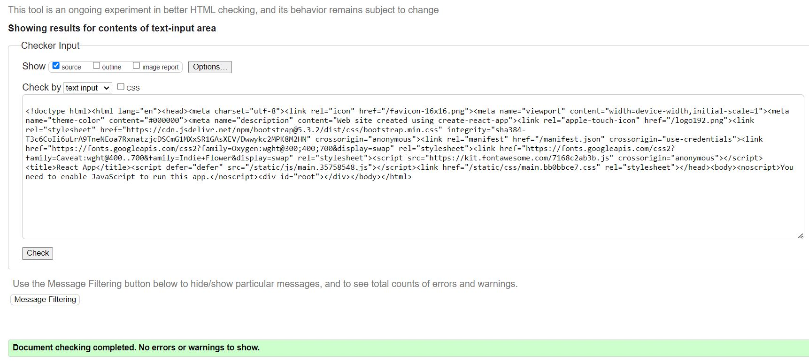 | https://validator.w3.org/nu/?doc=https%3A%2F%2Fsecrets-276f7be740ae.herokuapp.com%2F |

### CSS

I have used the recommended [CSS Jigsaw Validator](https://jigsaw.w3.org/css-validator) to validate all of my CSS files.

| Directory | File | Screenshot | Notes |
| --- | --- | --- | --- |
| src | App.module.css |  | 
| src | index.css | 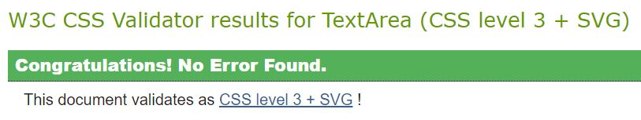 | |
| src | Asset.module.css |  | |
| src | Avatar.module.css |  | |
| src | Button.module.css |  | |
| src | NavBar.module.css |  | |
| src | Post.module.css |  | |
| src | PostCreateEditForm.module.css | 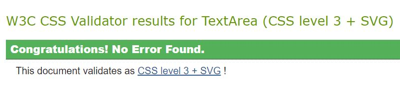 | |
| src | PostsPage.module.css | 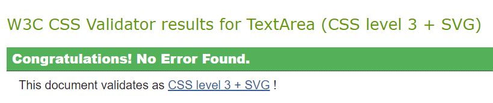 | |
| src | SignInUpForm.module.css |  | |
| src | Comment.module.css |  | |
| src | CommentCreateEditForm.module.css |  | |
| src | Diary.module.css |  | |
| src | Home.module.css |  | |
| src | MoreDropdown.module.css |  | |
| src | NotFound.module.css |  | |
| src | Profile.module.css |  | |
| src | ProfilePage.module.css |  | |
| src | Reachout.module.css |  | |
| src | ReachoutCreateForm.module.css |  | |

### JavaScript

ESlint - Has been used during developement and had the warning below which derives from my backend model name.
| ESlint |
| --- |
|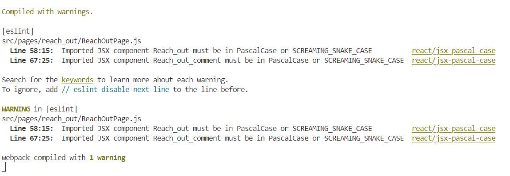|

## Browser Compatibility

I've tested my deployed project on multiple browsers to check for compatibility issues.

| Browser | Home | Signin | Signup | Secrets | Secrets Create | Secret | Secret Edit | Diary | Diary Entry | Blogposts | Blogpost | Blog Edit | Blog Create | Profiles | Profile Edit | Messages | Message | Username | Password | Not Found |
| --- | --- | --- | --- | --- | --- | --- | --- | --- | --- | --- | --- | --- | --- | --- | --- | --- | --- | --- | --- | --- | 
| Chrome |  |  |  |  |  |  |  |  |  |  |  |  |  |  |  |  |  |  |  |  | Works as expected |
| Firefox |  |  |  |  |  |  |  |  |  |  |  |  |  |  |  |  |  |  |  |  | Works as expected |
| Edge |  |  |  |  |  |  |  |  |  |  |  |  |  |  |  |  |  |  |  |  | Works as expected |

## Responsiveness

I've tested my deployed project on multiple devices to check for responsiveness issues.

| Device | Home | Signin | Signup | Secrets | Secrets Create | Secret | Secret Edit | Diary | Diary Entry | Blogposts | Blogpost | Blog Edit | Blog Create | Profiles | Profile Edit | Messages | Message | Username | Password | Not Found |
| --- | --- | --- | --- | --- | --- | --- | --- | --- | --- | --- | --- | --- | --- | --- | --- | --- | --- | --- | --- | --- |
| Mobile (DevTools) |  |  |  |  |  |  |  |  |  |  |  |  |  |  |  |  |  |  |  |  | Works as expected |
| Tablet (DevTools) |  |  |  |  |  |  |  |  |  |  |  |  |  |  |  |  |  |  |  |  | Works as expected |
| Desktop (DevTools) |  |  |  |  |  |  |  |  |  |  |  |  |  |  |  |  |  |  |  |  | Works as expected |

## Lighthouse Audit

I've tested my deployed project using the Lighthouse Audit tool to check for any major issues.

| Page | Mobile | Desktop | Notes |
| --- | --- | --- | --- |
| Home |  |  | Some minor warnings |
| Signin | 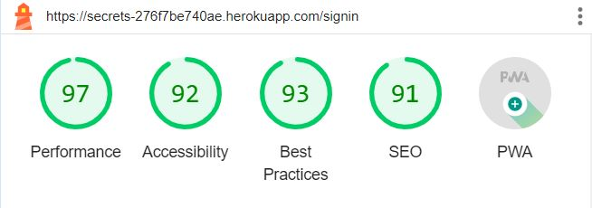 | 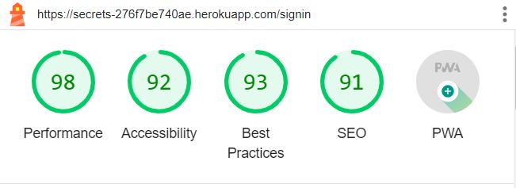 | Some minor warnings |
| Signup | 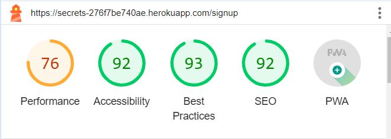 | 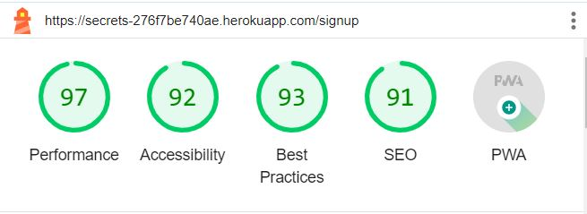 | Slow response time due to large images |
| Secrets | 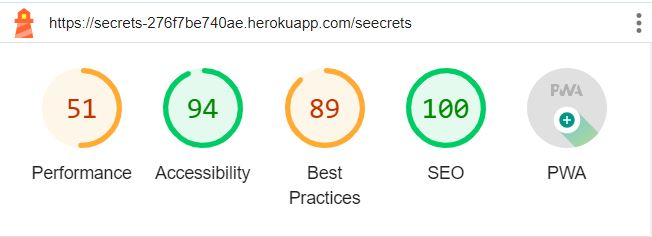 |  | Low scores expected because of loading multiple images from the API |
| Secrets Create | 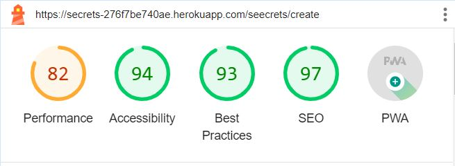 | 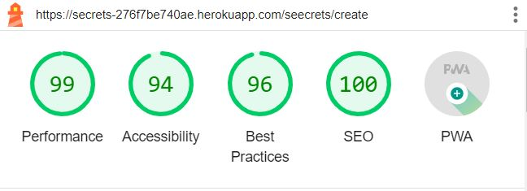 | Slow response time due to large images |
| Secret | 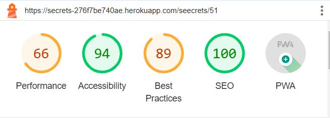 | 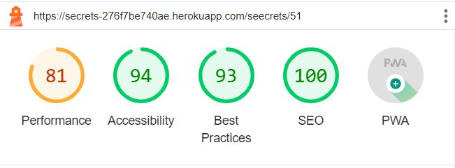 | Low scores expected because of loading multiple images from the API |
| Secret Edit | 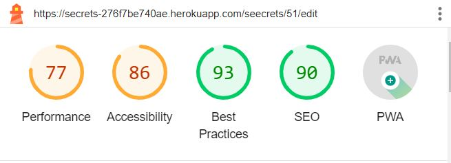 | 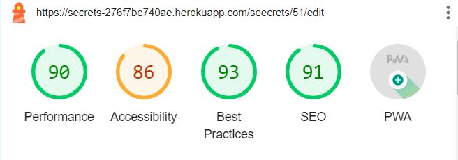 | Slow response time due to large images |
| Diary |  | 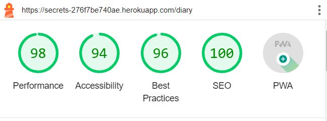 | Slow response time due to large images |
| Diary Entry | 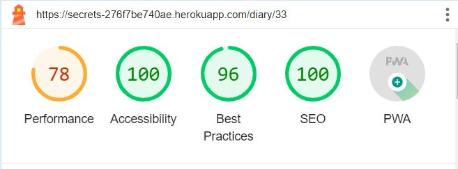 | 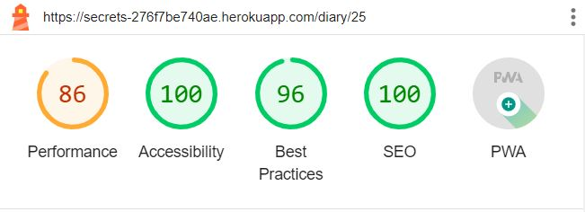 | Slow response time due to large images |
| Blogposts | 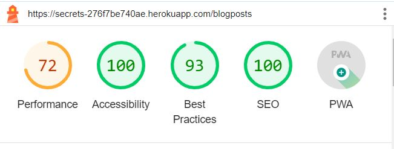 | 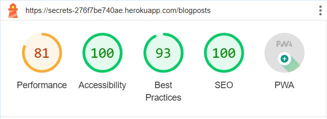 | Slow response time due to large images |
| Blogpost | 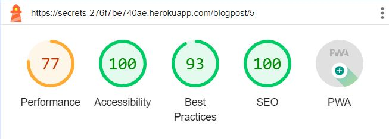 |  | Slow response time due to large images |
| Blog Edit | 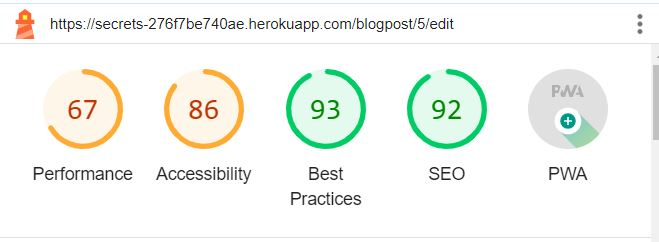 | 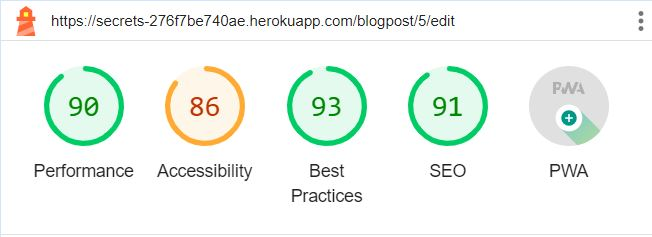 | Low scores expected because of loading multiple images from the API |
| Blog Create | 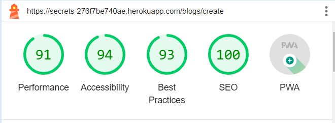 | 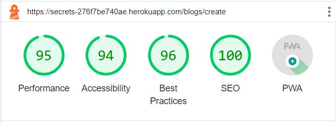 | Slow response time due to large images |
| Profiles | 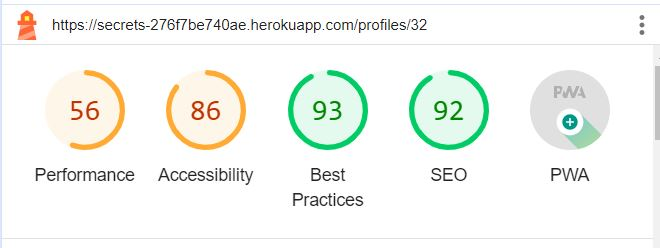 | 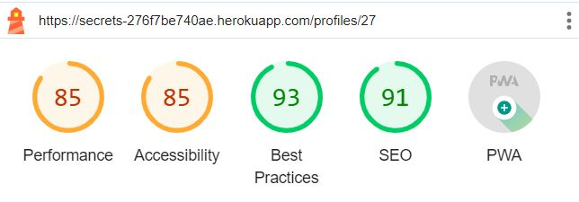 | Low scores expected because of loading multiple images from the API |
| Messages | 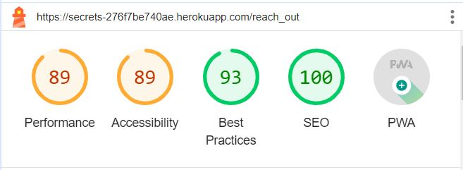 | 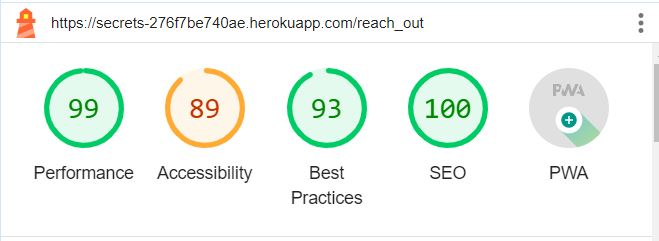 | Slow response time due to large images |
| Message | 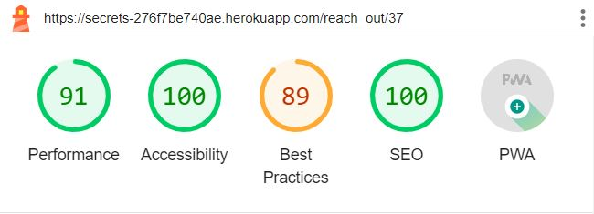 | 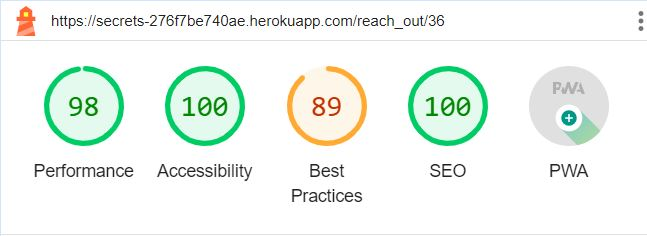 | Slow response time due to large images |
| Not Found | 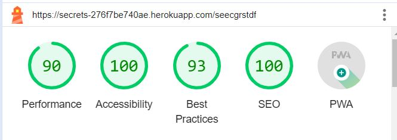 | 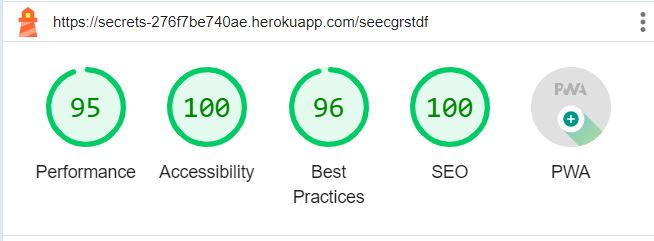 | Slow response time due to large images |

## Defensive Programming

Defensive programming was manually tested with the below user acceptance testing:

| Page | Expectation | Test | Result | Fix | Screenshot |
| --- | --- | --- | --- | --- | --- |
| Logo | | | | | |
| | Feature is expected to redirect to the home page when the user clicks on it | Tested the feature by clicking on it | The feature behaved as expected, and it redirected me to the home page | Test concluded and passed |  |
| Sign up | | | | | |
| | Feature is expected to create anew user and a profile | Tested the feature by filling the form | The feature behaved as expected, and it created a new user | Test concluded and passed |  |
| Sign in | | | | | |
| | Feature is expected to login an existed user | Tested the feature by signing in an already existing user | The feature behaved as expected, and it accessed the site | Test concluded and passed |  |
| Profile | | | | | |
| | Feature is expected to redirect the user to his/hers profile page when the user clicks on it | Tested the feature by clicking on it | The feature behaved as expected, and it redirected me to the profile| Test concluded and passed |  |
| Profile edit | | | | | |
| | Feature is expected to redirect the user to the profile edit form | Tested the feature by clicking on it | The feature behaved as expected, and it redirected me to the profile edit form| Test concluded and passed |  |
| Profile change username| | | | | |
| | Feature is expected to redirect the user to the form to change his/hers profile | Tested the feature by clicking on it | The feature behaved as expected, and it redirected me to the profile| Test concluded and passed | 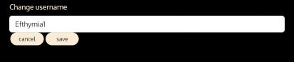 |
| Profile change password| | | | | |
| | Feature is expected to redirect the user to the form to change his/hers password | Tested the feature by clicking on it | The feature behaved as expected, and it redirected me to the change password form| Test concluded and passed | 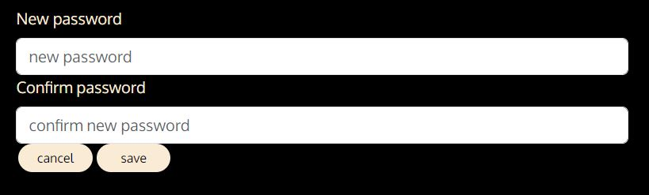 |
| Profile list| | | | | |
| | Feature is expected to redirect the user to other peoples' profile detail page | Tested the feature by clicking on an avatar | The feature behaved as expected, and it redirected me to that person's profile page | Test concluded and passed |  |
| Secret Create| | | | | |
| | Feature is expected to create a secret to feed of secrets | Tested the feature by filling the form | The feature behaved as expected, and added a secret to the feed | Test concluded and passed |  |
| Secrets| | | | | |
| | Feature is expected to show the secrets and redirect to secrets detail page when the user clicks on it | Tested the feature by clicking on a secret | The feature behaved as expected, and it redirected me to the secrets detail page | Test concluded and passed |  |
| Secret Edit| | | | | |
| | Feature is expected to redirect the user to the secrets edit form | Tested the feature by clicking on an avatar | The feature behaved as expected, and it redirected me to the secrets edit form | Test concluded and passed |  |
| Secret Delete| | | | | |
| | Feature is expected to redirect the user back to the feed | Tested the feature by clicking on it | The feature behaved as expected, and it redirected me to the feed | Test concluded and passed | |
| Secret Search| | | | | |
| | Feature is expected to find the secrets the user asks for | Tested the feature by search a secret | The feature behaved as expected, and found the secret | Test concluded and passed | 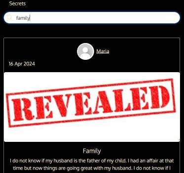 |
| Comment Create| | | | | |
| | Feature is expected to create a comment by filling the form and clicking on post | Tested the feature by filling the form and submitting | The feature behaved as expected, and it created a comment| Test concluded and passed |  |
| Comment Edit| | | | | |
| | Feature is expected to show me the comment form in place | Tested the feature by clicking on the edit icon| The feature behaved as expected, and showed me the form filled with the previous content | Test concluded and passed |  |
| Comment Delete| | | | | |
| | Feature is expected to remove the comment I made | Tested the feature by clicking on the icon | The feature behaved as expected, and it removed the comment | Test concluded and passed | |
| Diary form | | | | | |
| | Feature is expected to create a diary entry | Tested the feature by filling the form and submit it | The feature behaved as expected, and it created an entr| Test concluded and passed |  |
| Diary Entry | | | | | |
| | Feature is expected to redirect the diary entry where the whole content will be revealed| Tested the feature by clicking on it | The feature behaved as expected, and it redirected me to that specific diary entry| Test concluded and passed |  |
| Message form | | | | | |
| | Feature is expected to create a thread with the specific person chosen | Tested the feature by filling the form and logging in as the other user to see if the message was there | The feature behaved as expected, and it created a thread to mine and the other person's messages list| Test concluded and passed |  |
| Message | | | | | |
| | Feature is expected to redirect the user to the thread of this conversation where all the messages between the 2 people appear | Tested the feature by clicking on it | The feature behaved as expected, and showed me the whole conversation| Test concluded and passed |  |
| Blog Create | | | | | |
| | Feature is expected to appear only if the user is an administrator and create a blogpost by filling the form | Tested the feature by logging in as an administrator and filling the form | The feature behaved as expected, and created a blogpost | Test concluded and passed |  |
| Blog Edit or Delete | | | | | |
| | Feature is expected to redirect the blog edit form or to the blog if the blogpost is deleted | Tested the feature by clicking on the choices | The features behaved as expected, and it redirected me to the blog edit form or the blog respectively| Test concluded and passed |  |
| Blogposts | | | | | |
| | Feature is expected to redirect the user to the blog | Tested the feature by clicking on it | The feature behaved as expected, and it redirected me to the blog | Test concluded and passed |  |
| Sign Out | | | | | |
| | Feature is expected to sign the user out and redirect him/her to the home page | Tested the feature by clicking on it | The feature behaved as expected, and it signed me out| Test concluded and passed |  |
| Forms | | | | | |
| | Feature is expected to not let the users submit a blank form | Tested the feature by trying to submit a blank form | The feature behaved as expected, and did not let me | Test concluded and passed | 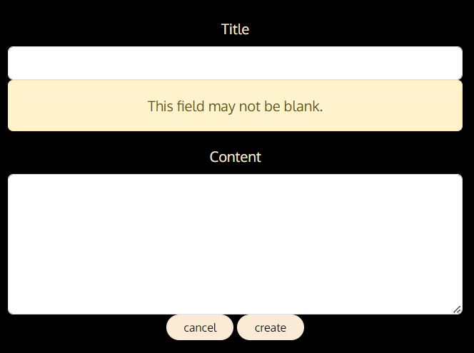 |
| | | | | Test concluded and passed | 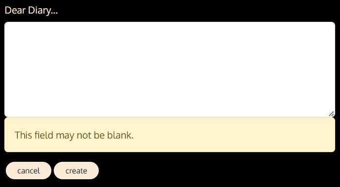 |
| | | | | Test concluded and passed | 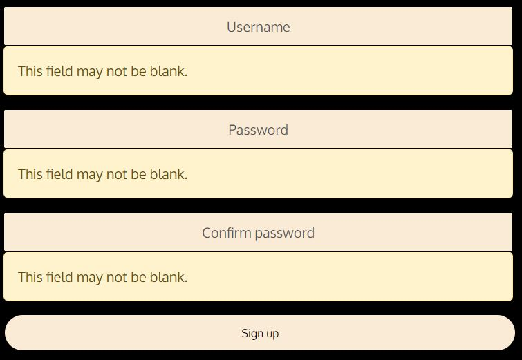 |
| | | | | Test concluded and passed | 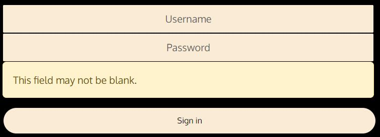 |
| Not Found | | | | | |
| | Feature is expected to display the not found page | Tested the feature by typing a url that does not exist| The feature behaved as expected, and it showed me the not found page | Test concluded and passed |  |
| Not Authorized | | | | | |
| | Feature is expected to display the error page | Tested the feature by logging in as a different user and typed the url of the messages page of the previous user | The feature behaved as expected, and it showed me the error | Test concluded and passed |  |

## User Story Testing

| User Story | Screenshot |
| --- | --- |
| As a new site user, I would like signin or signup, so that I can have access to the site. |   |
| As a new site user, I would like to be informed about what this site is all about, so that I can decide if it is for me. |  |
| As a new site user, I would like to check my profile and edit it, so that I can control the information I am giving out. |   |
| As a new site user, I would like to check other peoples' profiles, so that I can choose people to interact with. |  |
| As a new site user, I would like to share a secret with users of the site, so that I can unburden myself and feel relief. |  |
| As a new site user, I would like to edit and delete my secrets, so that I update information or in case I changed my mind. |  |
| As a new site user, I would like to check other peoples' secrets, so that I can see if I can find something I can relate to. | 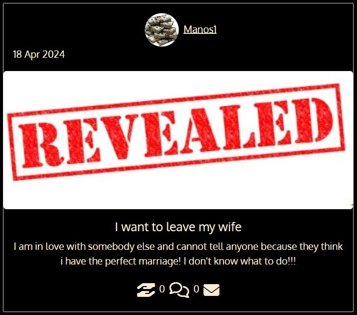 |
| As a new site user, I would like to comment on other peoples posts, so that I can express my opinion. |  |
| As a new site user, I would like to edit or delete my comments in case I change my mind. |  |
| As a new site user, I would like to keep a diary, so that I can document my thoughts and be helped by the process of writing. |  |
| As a new site user, I would like to message people privately and show support, so that I can connect with others and give and get help. |  |
| As a new site user, I would like to read the blog, so that I can get information about topics around keeping secrets and psychology of it. |  |
| As a new site user, I would like to signout, so that I can feel safe that my information is protected. |  |
| As a returning site user, I would like to do all of the above for the same reasons. |  |
| As a returning site user, I would like to check my messages and see if I have new, so that I can keep in touch with people. |  |
| As a returning site user, I would like to check the feed, so that I can be updated with new information. |  |
| As a site administrator, I should be able to add, edit and delete a blogpost, so that I can keep the users informed about this topic. |   |

## Bugs

**Fixed Bugs**

| Bug | Status |
| --- | --- |
| I was encountering a bug with the link to add a blogpost when the user is an administrator. The paged had to be refreshed for it to appear (or disappear if the user is not an administrator.) To fix that I added window.location.reload() to refresh the page upon sign in or sign up. | Fixed |

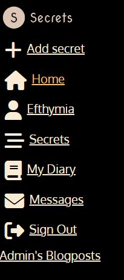
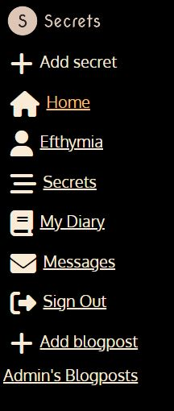
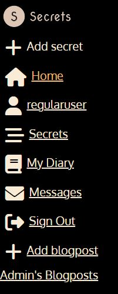
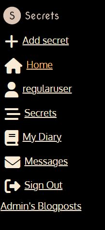

**Open Issues**

Any remaining open issues can be tracked [here](https://github.com/EfthymiaKakoulidou/secrets/issues).

## Unfixed Bugs

- I have an unfixed bug related to the profiles_id. The link to the profile in the Post component leads to the profile with the previous id than the one in the link. I am suspecting that this happened when at some point I tried to import data from the local environment of my api to heroku, or when I deleted users from the backend. I have not found how it was caused and the rest of the app works fine it is just the link in the Post that has this problem. A quick fix to this was to add 1 to the url that user is requesting. Even though this is not really a solution it fixed the problem for now. Further debugging in the future is going to be needed.

    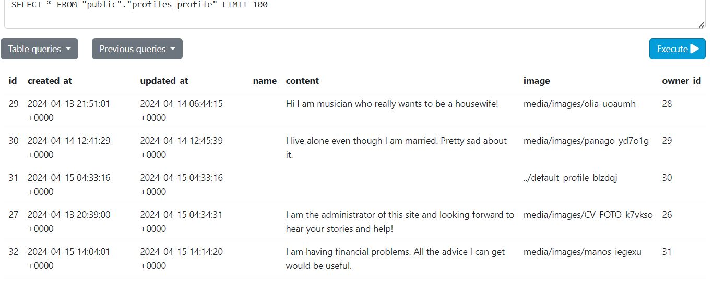

